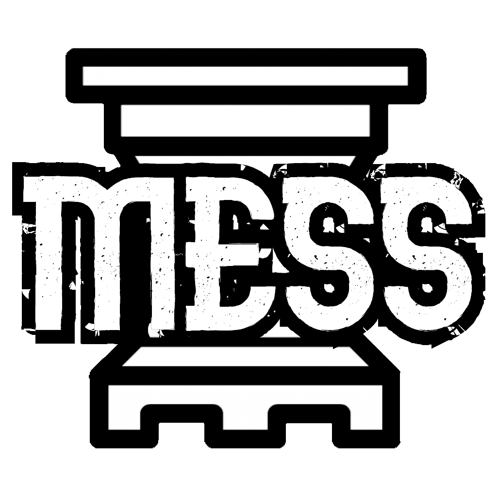

<div align="center">
  
  
  <br>
  
  
  
</div>

# Overview

Mess is an open source, UCI-compliant chess engine. Mess is not a complete chess program
and requires an UCI-compliant chess graphical user interface(e.g. XBoard with PolyGlot,
Scid, Cute Chess, eboard, Arena, Sigma Chess, Shredder, Chess Partner or Fritz) to be
used comfortably.

Mess's code structure is extremely modular and thus it may be used as a library for
developing chess engines in go. The [`./pkg`](./pkg) directory will contain all the
packages that are available for use publicly.

Mess is currently a work in progress and not very strong compared to strong humans or the
other chess engines out there. It is suggested that you use a different and more stronger
engine for analysing your games.

# Installation

### Prerequisites

The following need to be installed before you can install Mess:
- [The Go Programming Language](https://go.dev/dl/)
- [Git](https://git-scm.com/downloads) (for building from source)

### Install Globally

```bash
go install laptudirm.com/x/mess@latest
```

### Build from source
```bash
git clone https://github.com/rakarchive/mess.git
cd mess
go build . # creates a binary in your wd
```

# License

Mess is licensed under the [Apache 2.0 License](./LICENSE).
